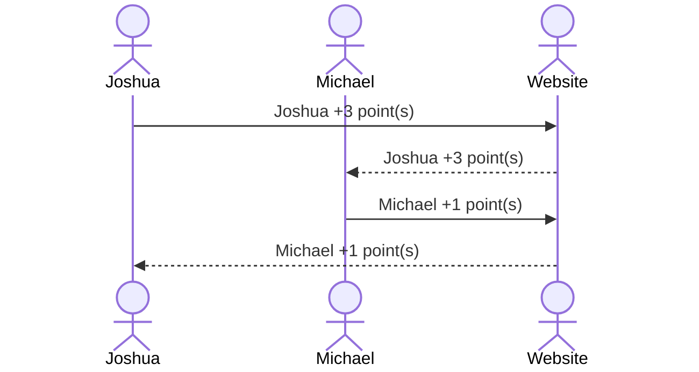

# Fantasy General Conference

[My Notes](notes.md)

> [!NOTE]
>  This is a template for your startup application. You must modify this `README.md` file for each phase of your development. You only need to fill in the section for each deliverable when that deliverable is submitted in Canvas. Without completing the section for a deliverable the TA will not know what to look for when grading your submission. Feel free to add additional information to each deliverable description, but make sure you at least have the list of rubric items and a description of what you did for each item.

> [!NOTE]
>  If you are not familiar with Markdown then you should review the [documenation](https://docs.github.com/en/get-started/writing-on-github/getting-started-with-writing-and-formatting-on-github/basic-writing-and-formatting-syntax) before continuing.

## 🚀 Specification Deliverable

> [!NOTE]
>  Fill in this sections as the submission artifact for this deliverable. You can refer to this [example](https://github.com/webprogramming260/startup-example/blob/main/README.md) for inspiration.

- [x] Proper use of Markdown in README.md
- [x] A concise and compelling elevator pitch in your README.md
- [x] Description of key features in your README.md
- [x] Description of how you will use each technology
- [x] One or more rough sketches of your application. Images must be embedded in your README.md.

### Elevator pitch

I have enjoyed listening to the messages of General Conference, but I also love to guess where temples will be announced. This has become a family friendly prediction competition! The goal of the game is to have the highest score by predicting who will speak and when, where temples are announced, tie colors, and a few other topics. To make it easier to play with friends in different places, this will allow anyone to login, select their predictions, and watch their results compete with others during the sessions. My hope is to make this program simple and enjoyable! A game that's light-hearted, fun, and invites others to tune into the messages of General Conference!

### Design

Here are three drawings that depict the three main pages of the program. The left-most illustration is the **Login** page. The middle illustration is the **Prediction** page. The right-most illustration is the **Scoreboard** page.  

**Login**  

This page includes boxes to input a username and email. There is also a space for text/image displaying the title.  

**Prediction**  

This page contains a group of categories and interactive boxes or menus to select answers and set predictions. There are also a few buttons which allow for selecting different pages and locking a user's answers.  

**Scoreboard**  

This page updates as answers and scores are submitted. The page displays the user with their score in comparison with other participating users.  

### Key features

- Page for registering or login 
- Ability to select user answers for their prediction
- Ability to alter predictions
- Ability for user to lock prediction
- Scoreboard of users and their scores
- Admin can access and input the correct answers

### Technologies

I am going to use the required technologies in the following ways.

- **HTML** - Uses HTML to provide a simple structure to the needed pages. A few HTML pages will be used for the login, predictions, and scoreboard pages.
- **CSS** - Uses CSS to improve the visual design and apply color to the display.
- **React** - A page containing components that are reactive to the user and their prediction input.
- **Service** - The backend service provides prediction options and retrieves the user's selection.
- **DB/Login** - Users register and login before they can fill out their predicitons. User information and predictions are safely stored in a database.
- **WebSocket** - As each user inputs their predictions, their scores are broadcasted to other users in the form of a scoreboard.

## 🚀 AWS deliverable

For this deliverable I did the following. I checked the box `[x]` and added a description for things I completed.

- [x] **Server deployed and accessible with custom domain name** - [My server link](https://minijosh.click).  
I deployed my server with an elastic IP address linked to my custom domain name (`minijosh.click`). On this server, I also have a security group enabled as well as capabilites for subdomain access.  

## 🚀 HTML deliverable

For this deliverable I did the following. I checked the box `[x]` and added a description for things I completed.

- [x] **HTML pages** - I completed the HTML pages for a login/index page, a guess pages for inputs, and a score page!
- [x] **Proper HTML element usage** - I used HTML elements in a way to be organized and clear in their purpose.
- [x] **Links** - I included links to the different pages of my HTML documents and my GitHub
- [x] **Text** - I included text for display, descriptions and placeholders
- [x] **3rd party API placeholder** - I have placeholders for a random dog photo as a greeting profile image, and will verify that emails are accurate after attempting to login/creat an account
- [x] **Images** - I use some images within my Guess page and on the index page
- [x] **Login placeholder** - I included a login placeholder, including options for a username, email, and password
- [x] **DB data placeholder** - My data placeholder is in the form of the inputs and scoreboard for storing and comparing inputs
- [x] **WebSocket placeholder** - The scoreboard will update the scores as guesses are inserted and compared with answers

## 🚀 CSS deliverable

For this deliverable I did the following. I checked the box `[x]` and added a description for things I completed.

- [x] **Header, footer, and main content body** - I used CSS to interact with various parts of the main content, but I also fixed a header and footer in place for navigation and crediting.
- [x] **Navigation elements** - I included CSS with my navigational elements so they were accessible on different formats of a screen and responsive.
- [x] **Responsive to window resizing** - The webpage is responsive to the windows resizing and mobile rotation.
- [x] **Application elements** - I used CSS to style and format elements within my HTML.
- [x] **Application text content** - I used CSS by applying fonts and resizing my text.
- [x] **Application images** - I used CSS to alter included images to my liking.

## 🚀 React part 1: Routing deliverable

For this deliverable I did the following. I checked the box `[x]` and added a description for things I completed.

- [ ] **Bundled using Vite** - I did not complete this part of the deliverable.
- [ ] **Components** - I did not complete this part of the deliverable.
- [ ] **Router** - Routing between login and voting components.

## 🚀 React part 2: Reactivity

For this deliverable I did the following. I checked the box `[x]` and added a description for things I completed.

- [ ] **All functionality implemented or mocked out** - I did not complete this part of the deliverable.
- [ ] **Hooks** - I did not complete this part of the deliverable.

## 🚀 Service deliverable

For this deliverable I did the following. I checked the box `[x]` and added a description for things I completed.

- [ ] **Node.js/Express HTTP service** - I did not complete this part of the deliverable.
- [ ] **Static middleware for frontend** - I did not complete this part of the deliverable.
- [ ] **Calls to third party endpoints** - I did not complete this part of the deliverable.
- [ ] **Backend service endpoints** - I did not complete this part of the deliverable.
- [ ] **Frontend calls service endpoints** - I did not complete this part of the deliverable.

## 🚀 DB/Login deliverable

For this deliverable I did the following. I checked the box `[x]` and added a description for things I completed.

- [ ] **User registration** - I did not complete this part of the deliverable.
- [ ] **User login and logout** - I did not complete this part of the deliverable.
- [ ] **Stores data in MongoDB** - I did not complete this part of the deliverable.
- [ ] **Stores credentials in MongoDB** - I did not complete this part of the deliverable.
- [ ] **Restricts functionality based on authentication** - I did not complete this part of the deliverable.

## 🚀 WebSocket deliverable

For this deliverable I did the following. I checked the box `[x]` and added a description for things I completed.

- [ ] **Backend listens for WebSocket connection** - I did not complete this part of the deliverable.
- [ ] **Frontend makes WebSocket connection** - I did not complete this part of the deliverable.
- [ ] **Data sent over WebSocket connection** - I did not complete this part of the deliverable.
- [ ] **WebSocket data displayed** - I did not complete this part of the deliverable.
- [ ] **Application is fully functional** - I did not complete this part of the deliverable.
